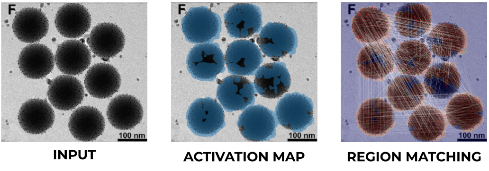

# Copy-Move Detection Module

This repository contains an implementation for detecting copy-move forgeries in scientific images. It supports both single-image duplication detection and cross-image duplication detection (finding reused regions between two different images).

This method is based on the [SILA](https://github.com/danielmoreira/sciint/tree/master) project.




## Features

*   **Single Image Copy-Move Detection**: Detects duplicated regions within a single image.
*   **Cross-Image Copy-Move Detection**: Detects common regions between two different images.
*   **Feature Extraction**: Supports multiple feature descriptors (e.g., Zernike Moments, PCT, FMT).
*   **Visualization**: Generates clear visualizations of matches (matching region) and clusters (activation map).
*   **Docker Support**: Easy-to-use Docker container for reproducible results.

## Installation

### Option 1: Docker (Recommended)

The easiest way to run the detector is using Docker.

1.  **Build the image:**
    ```bash
    docker build -f Dockerfile -t cmfd .
    ```

### Option 2: Local Installation

Requires Python 3.8.

1.  **Install dependencies:**
    ```bash
    pip install -r requirements.txt
    ```

## Usage

### Command Line Interface (CLI)

You can run detections directly from the command line using `src/run_detection.py`.

#### Single Image Detection
```bash
python src/run_detection.py --input path/to/image.png --output ./output
```

#### Cross-Image Detection
```bash
python src/run_detection.py --input path/to/imageA.png path/to/imageB.png --output ./output
```

#### Arguments
*   `--input`: Path to one image (for single detection) or two images (for cross detection).
*   `--output`: Directory to save results (masks and visualizations).
*   `--method`: Feature extraction method ID (default: 2 for ZM-polar).

### Docker Usage

Run the container mounting your data directory to `/data` and output directory to `/app/output`.

**Single Image:**

```bash
docker run --rm -v /path/to/input:/input -v /path/to/output:/output cmfd \
    --input /input/image.png \
    --output /output
```

**Cross-Image:**
```bash
docker run --rm -v /path/to/input1:/input1 -v /path/to/input2:/input2 -v /path/to/output:/output cmfd \
    --input /input1/imageA.png /input2/imageB.png \
    --output /output
```

### Python API

You can integrate the detector into your own Python scripts.

```python
from src.detector import CopyMoveDetector, CrossImageCopyDetector
from src.utility.utilityImage import imread2f

# Configuration
config = {
    'type_feat': 2,  # 1: ZM-cart, 2: ZM-polar, 3: PCT-cart, 4: PCT-polar, 5: FMT
}

# --- Single Image Detection ---
detector = CopyMoveDetector(config)
img = imread2f('path/to/image.png')
mask, clusters = detector.run(img)

# Visualize
detector.visualize_matches()
detector.visualize_clusters()

# --- Cross-Image Detection ---
cross_detector = CrossImageCopyDetector(config)
imgA = imread2f('path/to/imageA.png')
imgB = imread2f('path/to/imageB.png')
maskA, maskB, clustersA, clustersB = cross_detector.run(imgA, imgB)
```
### Logging and Progress Tracking

The detector supports standard Python logging and a status callback for tracking progress, which is useful for integration with job queues or UI updates.

**Logging:**
The detector logs messages to the `src.detector` logger. You can configure the logging level and format using standard Python `logging`.

**Status Callback:**
The `run` method accepts a `status_callback` function that receives the current stage (string) and progress (float 0.0-1.0).

```python
import logging
from src.detector import CopyMoveDetector
from src.utility.utilityImage import imread2f

# Configure logging
logging.basicConfig(level=logging.INFO)

# Define a callback function
def my_callback(stage, progress):
    print(f"Current Stage: {stage}, Progress: {progress*100:.1f}%")

detector = CopyMoveDetector()
img = imread2f('path/to/image.png')

# Run with callback
mask, clusters = detector.run(img, status_callback=my_callback)
```

## Acknowledgments

The core PatchMatch algorithm and utility functions used in this project were implemented by the **Image Processing Research Group of University Federico II of Naples ('GRIP-UNINA')**  and are based on the research work from Cozzolino et al. ([10.1109/TIFS.2015.2455334](https://doi.org/10.1109/TIFS.2015.2455334)). It's LICENSE does not allow commercial usage of this method.

## Citation

If you use this code, please cite:

> Moreira, D., Cardenuto, J.P., Shao, R. et al. SILA: a system for scientific image analysis. Nature Scientific Reports 12 (18306), 2022.
> https://doi.org/10.1038/s41598-022-21535-3

```bibtex
@article{sila,
   author = {Moreira, Daniel and Cardenuto, João Phillipe and Shao, Ruiting and Baireddy, Sriram and Cozzolino, Davide and Gragnaniello, Diego and Abd‑Almageed, Wael and Bestagini, Paolo and Tubaro, Stefano and Rocha, Anderson and Scheirer, Walter and Verdoliva, Luisa and Delp, Edward},
   title = {{SILA: a system for scientifc image analysis}},
   journal = {Nature Scientific Reports},
   year = 2022,
   number = {12},
   volume = {18306},
   pages = {1--15}
}
```
